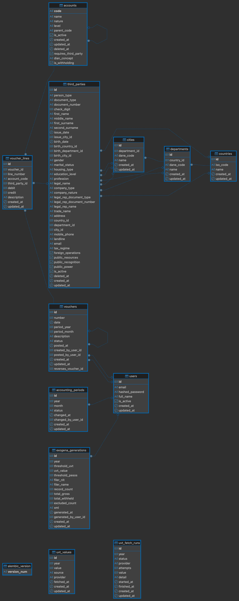

# accounting-project

Plataforma contable colombiana: plan de cuentas (PUC), comprobantes de partida
doble, libro mayor, cierre de períodos e información exógena. Monorepo
FastAPI + Next.js; todo corre en Docker.

**Demo:** <http://46.224.38.172:3001> — `demo@accounting-project.dev` /
`demo-accounting-2026`, con el PUC completo cargado (2.446 cuentas).

| Servicio | Stack                                | Puerto             |
| -------- | ------------------------------------ | ------------------ |
| `web`    | Next.js 16, React 19, Tailwind 4     | 3000               |
| `api`    | FastAPI 0.140, SQLAlchemy 2, Alembic | 8000               |
| postgres | Postgres 17                          | 5432 (solo en dev) |
| redis    | Redis 7                              | 6379 (solo en dev) |

## Inicio rápido

Requisito: Docker. Ni Node ni Python en la máquina.

```bash
cp .env.example .env      # arranca tal cual, sin editar nada
docker compose -f docker-compose.local.yml up -d --build
docker compose -f docker-compose.local.yml exec api alembic upgrade head
docker compose -f docker-compose.local.yml exec api python -m app.seed
```

- Web: <http://localhost:3000> — **`admin@local.dev`** / **`local-admin-2026`**
- API: <http://localhost:8000/docs>

El seed solo corre en `ENVIRONMENT=local` y es idempotente: crea el usuario,
142 cuentas del PUC ([`api/fixtures/puc.csv`](./api/fixtures/puc.csv), con el
concepto DIAN y la marca de retención que la exógena necesita), seis terceros y
un año de comprobantes en 2025 — incluida una reversión y un borrador — para que
cada pantalla tenga datos. La misma planilla en formato de importación está en
[`api/fixtures/puc.xlsx`](./api/fixtures/puc.xlsx).

Comandos de a diario, todos con `-f docker-compose.local.yml`:

| Comando                                     | Descripción         |
| ------------------------------------------- | ------------------- |
| `… exec api pytest`                         | Pruebas de la API   |
| `… exec api alembic upgrade head`           | Aplicar migraciones |
| `… exec api alembic revision --autogenerate -m "msg"` | Nueva migración |

## Pantallas

| Ruta             | Qué hace                                                               |
| ---------------- | ---------------------------------------------------------------------- |
| `/accounts`      | El PUC como árbol: CRUD, borrado lógico, importación y gráfica de saldo |
| `/third-parties` | Personas y empresas, catálogos DANE, dígito de verificación del NIT     |
| `/vouchers`      | Editor de comprobantes: borrador, contabilización, reversión            |
| `/ledger`        | El libro: movimientos con saldo acumulado, filtros y export a .xlsx     |
| `/periods`       | Cierre y reapertura de los meses                                        |
| `/exogena`       | XML de exógena, historial re-descargable y la UVT detrás del umbral     |

Español e inglés a un clic; el idioma es una cookie, no un segmento de la URL.

## Arquitectura

**La API, por módulos de dominio** (`api/app/modules/`): `accounts`, `vouchers`,
`periods`, `ledger`, `third_parties`, `locations`, `exogena`, `uvt`, `auth`,
`health`. Cada módulo repite el mismo molde, así que se sabe dónde mirar sin
abrir nada:

| Archivo      | Responsabilidad                                             |
| ------------ | ----------------------------------------------------------- |
| `models.py`  | Las tablas. SQLAlchemy y nada más                           |
| `schemas.py` | Lo que entra y sale por HTTP. Pydantic, en el borde         |
| `service.py` | Las reglas y las transacciones. No sabe qué es una petición |
| `router.py`  | Rutas, códigos de estado y dependencias. Sin lógica         |
| `errors.py`  | Errores del módulo; un solo handler los traduce a HTTP      |

La dirección de dependencias es siempre `router → service → models`, y ningún
módulo importa el router de otro: para leer un dato se consulta la tabla ajena;
para aplicar una regla se llama al service ajeno (comprobantes le pregunta a
`PeriodService` si el mes está abierto). Las reglas puras — jerarquía del PUC,
partida doble, dígito de verificación, XML — viven en archivos sin framework
(`puc.py`, `posting.py`, `documents.py`, `report.py`) que se prueban sin base
de datos.

**La web, por rutas** (`web/src/`): las páginas son Server Components que traen
los datos con el token — una cookie httpOnly que nunca llega al navegador — y la
interacción vive en Client Components que escriben únicamente a través de
Server Actions. Por eso `API_URL` no es `NEXT_PUBLIC_*`.

## Modelo de datos



Tres ausencias deliberadas:

- **El período no tiene FK con el comprobante.** Solo los meses cerrados tienen
  fila — un mes sin fila está abierto —, así que una FK obligaría a sembrar los
  doce meses por adelantado. `vouchers` guarda `period_year` y `period_month`.
- **La exógena copia la UVT en vez de apuntarla.** `uvt_values` se corrige en
  sitio; la generación guarda el valor y el umbral usados, como una factura
  guarda el precio.
- **No hay tabla de saldos ni de empresa.** El libro es una agregación sobre las
  líneas contabilizadas, y la empresa es configuración del `.env`.

## Decisiones de diseño

- **El código es la jerarquía.** El nivel es la longitud del código
  (`1` → `11` → `1105` → `110505` → auxiliar) y el padre es su prefijo: ambos se
  derivan a la entrada y no pueden contradecirse. Leer una rama es un `LIKE`.
- **Solo las hojas reciben movimientos.** Contabilizar en `1105` existiendo
  `110505` contaría doble en todo reporte que recorra el árbol.
- **Los saldos se calculan, nunca se guardan.** Una segunda copia se separa de
  la primera en cuanto una escritura falla a medias; si se volviera lento, vista
  materializada y no columna.
- **El cuadre es precondición de contabilizar.** Débitos = créditos y mínimo dos
  líneas antes de entrar a los libros, en el dominio y en la base.
- **Un contabilizado no se altera: se reversa.** El asiento inverso se
  contabiliza en la misma operación y el par queda visible y enlazado.
- **Cierre por período, reapertura permitida.** Con quién y cuándo en cada
  cambio; un cierre irreversible volvería permanente un mes mal digitado.
- **La empresa es configuración.** Una sola empresa haría de `companies` una
  tabla de una fila; con varias, sería una columna de tenant.
- **Concurrencia sin bloqueos.** El consecutivo lo garantiza un índice único y
  el perdedor reintenta; lo demás es una transacción por comprobante.
- **Ningún float toca un importe.** `Numeric(18,2)` en Postgres, `Decimal` en
  Python, cadenas decimales en HTTP y centavos enteros en el navegador.
- **La exógena es una instantánea.** Cada generación guarda sus bytes:
  re-descargarla entrega lo que se presentó, no lo que dirían los libros hoy. La
  UVT se refresca en segundo plano, con cada intento registrado, y un valor
  manual manda sobre la fuente.

## Pruebas

Cuarenta, en `api/tests`. No son cobertura: hay una por regla que, si se rompe,
deja los libros mal sin que nadie lo note a tiempo. En orden de riesgo: el
cuadre (con `0.10 + 0.20 = 0.30` en `Decimal`), la jerarquía del PUC, los
estados del comprobante y las tres reversiones prohibidas, el período cerrado,
el libro que suma cero, la exógena byte a byte contra su re-descarga, los
reintentos de la UVT y un test que recorre todos los endpoints sin token.

Hueco conocido: **la concurrencia no tiene prueba** — la suite corre sobre
SQLite en memoria y la carrera por el consecutivo no se reproduce ahí. La
garantía es el índice único más el reintento; ver «Pendientes».

## Extras implementados

- **Exportación del libro a .xlsx** — un contador pega el libro en un papel de
  trabajo; openpyxl ya era dependencia de la importación.
- **Gráfica de saldo en el tiempo** — SVG propio (una gráfica no justifica una
  librería), escalonada porque un saldo mantiene su valor hasta el siguiente
  movimiento.
- **Autenticación JWT** — cookie httpOnly, solo el servidor llama a la API.
- **Un comando levanta todo** — `docker compose -f docker-compose.local.yml up`.
- **CI en GitHub Actions** — ruff, mypy y pytest para la API; ESLint, `tsc` y
  build de producción para la web, todo dentro de las imágenes del repositorio;
  en `main`, publica a GHCR y despliega con
  [`scripts/deploy.sh`](./scripts/deploy.sh), idempotente.

## Limitaciones

- **Una empresa, una moneda, sin multi-tenencia.**
- **Sin administración de usuarios ni roles** — todo autenticado puede todo.
- **Sin adjuntos, PDF ni reportes impresos.**
- **La UVT se lee de una página de terceros** — parseo defensivo y cada intento
  registrado, pero un cambio de maquetación allá rompe la consulta; de ahí la
  sobrescritura manual.
- **Sin cola ni eventos** — todo se resuelve en la petición; a más escala, ver
  producción.

## Pendientes

- **La prueba de concurrencia.** Cómo: Postgres dentro de la suite y dos
  contabilizaciones en paralelo; la garantía a observar ya existe.
- **El PUC completo.** Cómo: reemplazar `api/fixtures/puc.csv` por el catálogo
  entero — ni el seed ni la importación cambian.
- **El libro auxiliar arma el archivo en memoria.** Cómo: cursor por cuenta y
  `write_only` de openpyxl; el contrato de la API no cambia.

## Qué cambiaría para producción

- **Auditoría en los datos maestros** — comprobantes y períodos ya registran
  quién y cuándo; una tabla `quién/cuándo/qué` cubriría el resto.
- **Una cola para los trabajos en segundo plano** — Redis ya está en el stack;
  el refresco de la UVT y lo que se le sume pertenecen a un worker con
  reintentos que sobreviva al reinicio.
- **Rate limiting y bloqueo en el login**, que hoy acepta intentos tan rápido
  como lleguen.

## Producción

No hay `docker-compose.yml`: el modo se nombra siempre y no se puede levantar
uno creyendo que es el otro.

```bash
docker compose -f docker-compose.prod.yml up -d --build
docker compose -f docker-compose.prod.yml exec api alembic upgrade head
```

Imágenes desde el target `prod` (sin dependencias de desarrollo, usuario sin
privilegios, Next `standalone`), Postgres y Redis sin puertos en el host, y las
migraciones se disparan explícitamente para que varias réplicas no compitan
entre sí.
